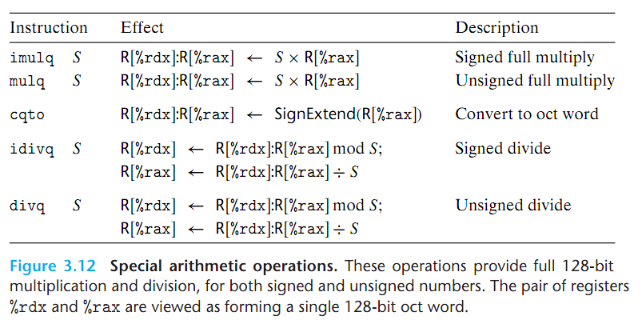
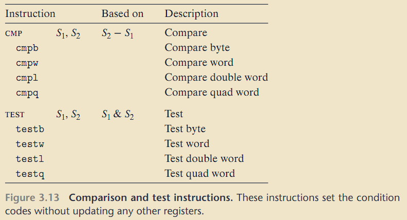
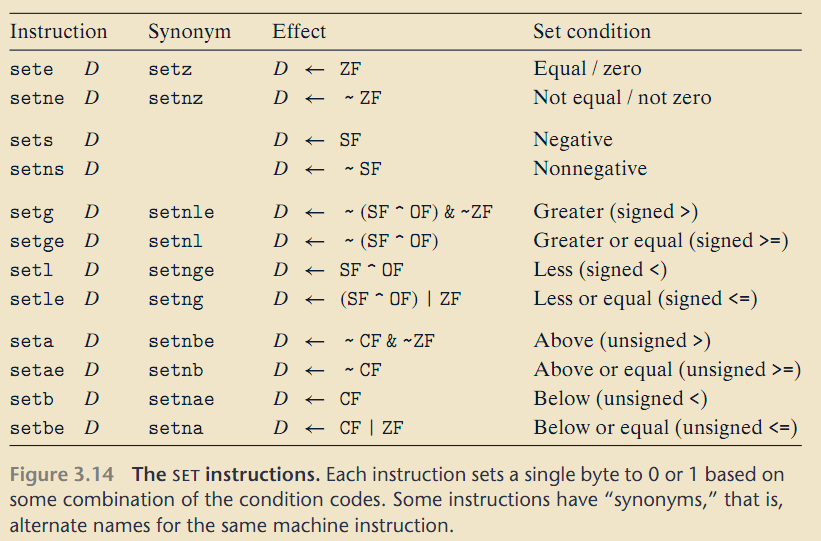
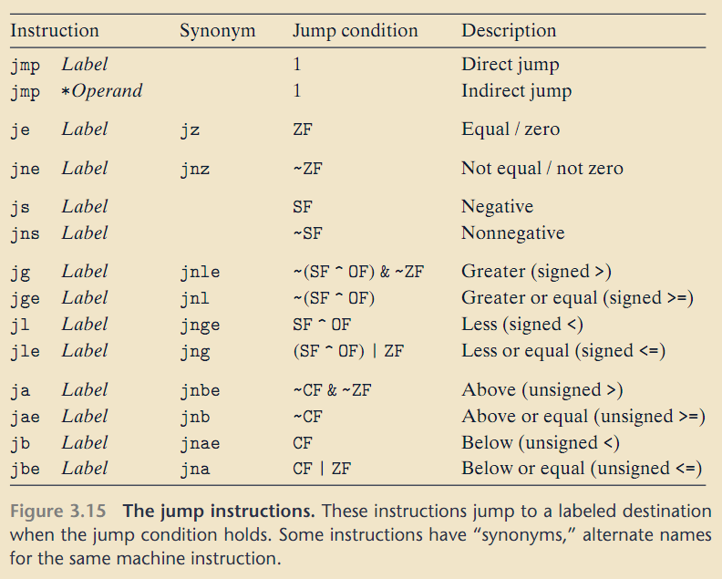
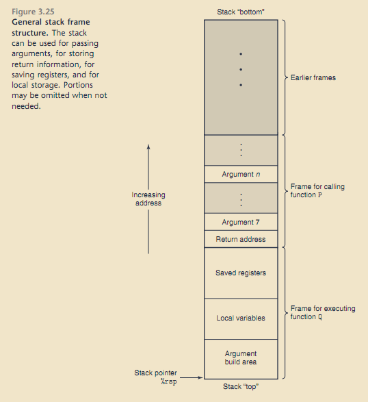
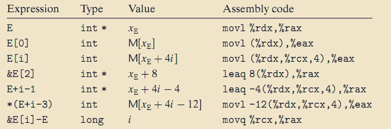
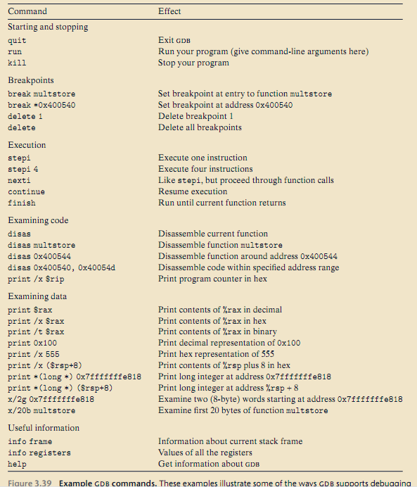

# 1. Machine-Level Representation of Program

<!-- TOC -->

- [1. Machine-Level Representation of Program](#1-machine-level-representation-of-program)
  - [1.1. Machine-Level Code](#11-machine-level-code)
  - [1.2. Data Formats](#12-data-formats)
  - [1.3. Accessing Information](#13-accessing-information)
    - [1.3.1. Operand Specifiers](#131-operand-specifiers)
    - [1.3.2. Data Movement Instructions](#132-data-movement-instructions)
    - [1.3.3. Pushing and Popping Stack Data](#133-pushing-and-popping-stack-data)
  - [1.4. Arithmetic and Logical Operations](#14-arithmetic-and-logical-operations)
    - [1.4.1. Special Arithmetic Operations](#141-special-arithmetic-operations)
  - [1.5. Control](#15-control)
    - [1.5.1. Condition Codes](#151-condition-codes)
    - [1.5.2. Accessing the Condition Codes](#152-accessing-the-condition-codes)
    - [1.5.3. Jump Instructions](#153-jump-instructions)
    - [1.5.4. Implementing Conditional Branches with Conditional Moves](#154-implementing-conditional-branches-with-conditional-moves)
    - [1.5.5. Loops](#155-loops)
    - [1.5.6. Switch Statements](#156-switch-statements)
  - [1.6. Procedures](#16-procedures)
    - [1.6.1. The Run-Time Stack](#161-the-run-time-stack)
    - [1.6.2. Control Transfer](#162-control-transfer)
    - [1.6.3. Data Transfer](#163-data-transfer)
    - [1.6.4. Local Storage on the Stack](#164-local-storage-on-the-stack)
    - [1.6.5. Local Storage in Registers](#165-local-storage-in-registers)
  - [1.7. Array Allocation and Access](#17-array-allocation-and-access)
    - [1.7.1. Basic Principles](#171-basic-principles)
    - [1.7.2. Pointer Arithmetic](#172-pointer-arithmetic)
    - [1.7.3. Nested Arrays](#173-nested-arrays)
    - [1.7.4. Fixed-Size Arrays](#174-fixed-size-arrays)
    - [1.7.5. Variable-Size Arrays](#175-variable-size-arrays)
  - [1.8. Heterogeneous Data Structures](#18-heterogeneous-data-structures)
    - [1.8.1. Structures](#181-structures)
    - [1.8.2. Unions](#182-unions)
    - [1.8.3. Data Alignment](#183-data-alignment)
  - [1.9. Combining Control and Data in Machine-level Programs](#19-combining-control-and-data-in-machine-level-programs)
    - [1.9.1. Understanding Pointers](#191-understanding-pointers)
    - [1.9.2. Life in the Real World: Using the `GDB` debugger](#192-life-in-the-real-world-using-the-gdb-debugger)

<!-- /TOC -->

## 1.1. Machine-Level Code

Several features about machine code and its disassembled representation are worth noting:

- x86-64 instructions can range in length from 1 to 15 bytes.
- The instruction format is designed in such a way that from a given starting position.

## 1.2. Data Formats

## 1.3. Accessing Information

### 1.3.1. Operand Specifiers

### 1.3.2. Data Movement Instructions

- x86-64 imposesthe restriction that a move instruction cannot have both operands refer to **memory locations**.

- Immediate **source** operands can be represented as 32-bit two's-complement numbers in `movq`.

- **Memory reference** in x86-64 are always given with quad word registers, such as `%rax`,even if the operand is a byte, single word, or double word.

- The `MOV` instructions will only update the specific register bytes or memory locations indicated by the destination operand. The only exception is that when `movl` has a register as the destination, it will also set the high-order 4 bytes of the register to 0.
  > Adopted in x86-64, that any instruction that generates a 32-bit value for a register also set the high-order portion of the register to 0.

### 1.3.3. Pushing and Popping Stack Data

## 1.4. Arithmetic and Logical Operations

### 1.4.1. Special Arithmetic Operations

## 1.5. Control

### 1.5.1. Condition Codes

- **CF: Carry flag**. The most recent operation generated a carry out of the most significant bit. Used to detect overflow for unsigned operations.
- **ZF: Zero flag**. The most recent operation yielded zero.
- **SF: Sign flag**. The most recent operation yielded a negative value.
- **OF: Overflow flag**. The most recent operation caused a two’s-complement
  overflow—either negative or positive.

The `leaq` instruction does not alter any condition codes. The `INC` and `DEC` instructions set the overflow and zero flags, but they leave the carry flag unchanged.

### 1.5.2. Accessing the Condition Codes

Although all arithmetic and logical operations set the condition codes, the descriptions of the different `SET` instructions apply to the case where a comparison instruction has been executed, setting the condition codes according to the computation `t = a-b`.

### 1.5.3. Jump Instructions

### 1.5.4. Implementing Conditional Branches with Conditional Moves

### 1.5.5. Loops

Two translation methods:

- `jump to middle`

- `guarded do` (optimization level: -O1)

### 1.5.6. Switch Statements

Using a structure called a `jump table`. A jump table is an array where entry $i$ is the address of a code segment implementing the action the program should take when the switch index equals $i$.

## 1.6. Procedures

$P$ call $Q$.

- **Passing control**. The program counter must be set to the starting address of the code for $Q$ upon entry and then set to the instruction in $P$ following the call to $Q$ upon return.

- **Passing data**. $P$ must be able to provide one or more parameters to $Q$, and $Q$ must be able to return a value back to $P$.

- **Allocating and deallocating memory**. $Q$ may need to allocate space for local variables when it begins and then free that storage before it returns.

### 1.6.1. The Run-Time Stack

### 1.6.2. Control Transfer

### 1.6.3. Data Transfer

With x86-64, up to **six** integral (i.e., integer and pointer) arguments can be passed via registers.

When **passing parameters** on the **stack**, all data sizes are rounded up to be **multiples of eight**.

### 1.6.4. Local Storage on the Stack

Local data must be stored in memory. Common cases of this include these:

- There are not enough registers to hold all of the local data.

- The address operator `&` is applied to a local variable, and hence we must be able to generate an address for it.

- Some of the local variables are arrays or structures and hence must be accessed by array or structure references.

### 1.6.5. Local Storage in Registers

- By convention, registers %rbx, %rbp, and %r12–%r15 are classified as callee-saved registers.

  > When procedure P calls procedure Q, Q must preserve the values of these registers, with this convention, the code for P can safely store a value in a callee-saved register.

- All other registers, except for the stack pointer %rsp, are classified as caller-saved registers.

## 1.7. Array Allocation and Access

### 1.7.1. Basic Principles

Declaration of the form `T A[N]`:

Let us denote the starting location as $x_A$. The declaration has two effects.

- First, it allocates a contiguous region of $L\cdot N$ bytes in memory, where $L$ is the size (in bytes) of data type `T` .

- Second, it introduces an identifier `A` that can be used as a pointer to the beginning of the array. The value of this pointer will be $x_A$. The array elements can be accessed using an integer index ranging between $0$ and $N−1$. Array element $i$ will be stored at address $x_A + L\cdot i$.

### 1.7.2. Pointer Arithmetic

Suppose the starting address of integer array `E` and integer index $i$ are stored in registers `%rdx` and `%rcx`, respectively.

### 1.7.3. Nested Arrays

Declaration of the form `T D[R][C]`.

Array element `D[i][j]` is at memory address:

$$\&D[i][j] = x_D + L(C\cdot i + j)$$

where $L$ is the size of data type `T` in bytes.

### 1.7.4. Fixed-Size Arrays

### 1.7.5. Variable-Size Arrays

- pointer-based code

- array-based code

## 1.8. Heterogeneous Data Structures

### 1.8.1. Structures

### 1.8.2. Unions

### 1.8.3. Data Alignment

Intel alignment rule is based on the principle that any primitive object of $K$ bytes must have an address that is a multiple of $K$.

> Optimazation: One Strategy that works, when all data elements have a length equal to a power of 2, is to order the structure elements in decending order of size.

## 1.9. Combining Control and Data in Machine-level Programs

### 1.9.1. Understanding Pointers

- Every pointer has an associated type.

- Every pointer has a value.

- Pointers are created with the `&` operator.

- Pointers are dereferenced with the `*` operator.

- Casting from one type of pointer to another changes its type but not its value.

### 1.9.2. Life in the Real World: Using the `GDB` debugger

