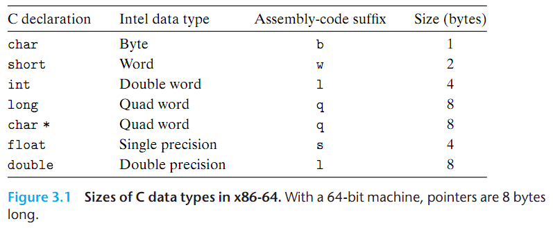
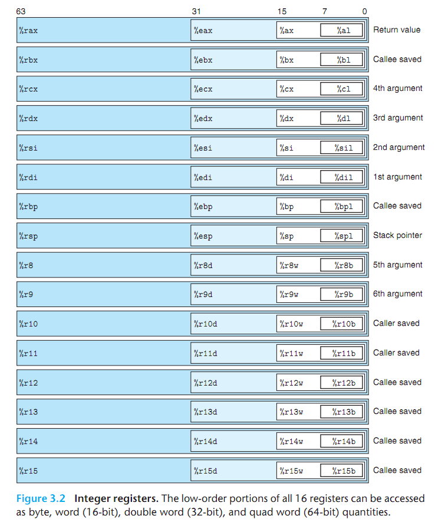
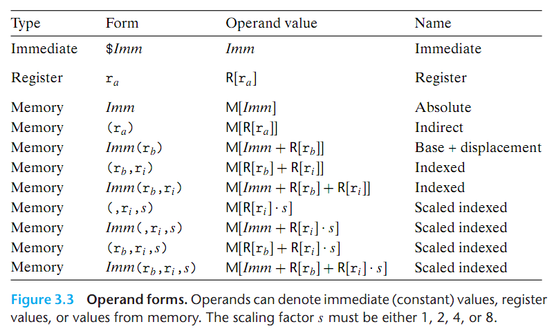
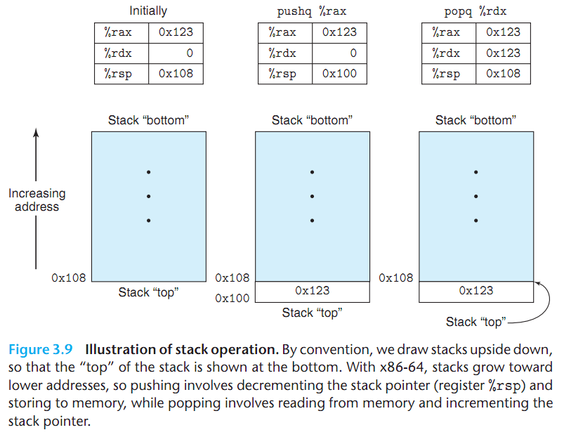
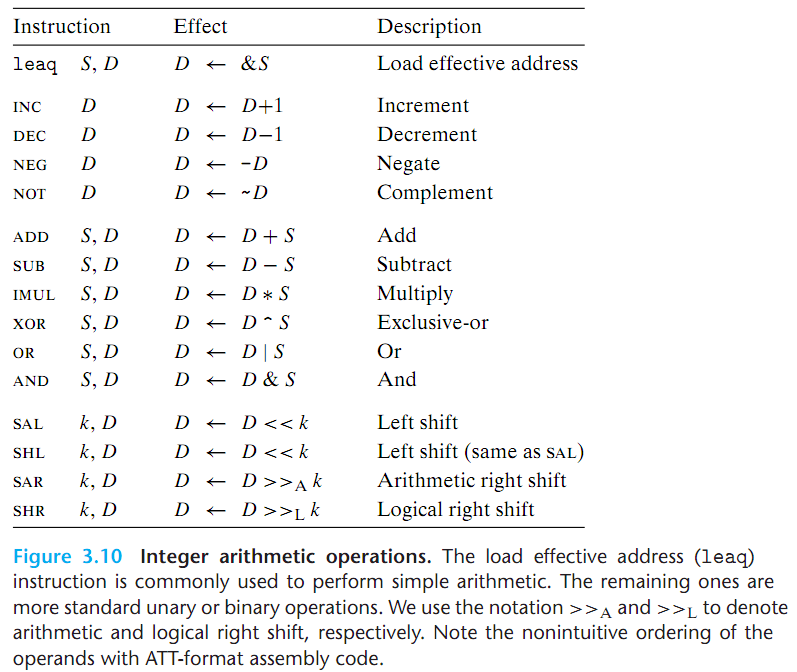

# 1. Machine-Level Representation of Program

## 1.1. Machine-Level Code

Several features about machine code and its disassembled representation are worth noting:

- x86-64 instructions can range in length from 1 to 15 bytes.
- The instruction format is designed in such a way that from a given starting position.

## 1.2. Data Formats

## 1.3. Accessing Information

### 1.3.1. Operand Specifiers

### 1.3.2. Data Movement Instructions

- x86-64 imposesthe restriction that a move instruction cannot have both operands refer to **memory locations**.

- Immediate **source** operands can be represented as 32-bit two's-complement numbers in `movq`.

- **Memory reference** in x86-64 are always given with quad word registers, such as `%rax`,even if the operand is a byte, single word, or double word.

### Pushing and Popping Stack Data

## Arithmetic and Logical Operations

